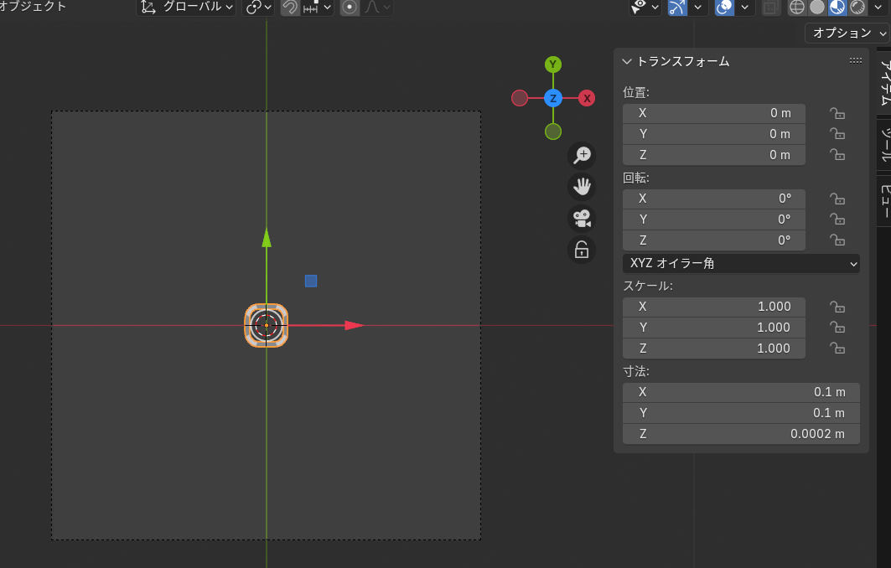

# Make-dataset-using-Blender
Blenderでドローンのゲートのデータセットを作る時に使います。  
FUSIONなどで作成した四角のドローンゲートを画像の位置、スケール、サイズ、回転などに合わせます。  
  
カメラの高さは1m。  
F1、F2とかは自分のモデルごとに図って入力する。  
投影方法は、魚眼じゃないやつ。  
ライトもセットして、  
もうわからん  
